- bios(Basic Input/Output System) is stored in rom
- memory is accessed in a linear fashion
- memory is divided into pages
- page table is used to map virtual address to physical address
- tlb is used to cache the page table
- various memory schemes used by processor, like segmentation, paging, etc
- memory management unit is used to translate virtual address to physical address
- memory protection is done by setting the access rights in the page table

Boot Process
- BIOS is stored in ROM
- BIOS loads the boot loader from the boot sector of the disk in address 0x7c00 in case of x86
- Boot sector is first 512 bytes of the disk or any bootable medium (like a hard drive, floppy disk, or USB stick).
  - The very first 512 bytes of the storage device is called the Master Boot Record (MBR) on traditional BIOS-based systems.
  - These 512 bytes are split into:
  - Bootloader code (usually the first 446 bytes): Code that is executed by the BIOS at boot time.
  - Partition table (next 64 bytes): Describes the layout (start/end addresses) of partitions on the disk.
  - Boot signature (last 2 bytes, always 0x55AA): A magic number that tells the BIOS that the sector is bootable.
- Boot loader loads the kernel into memory
- Kernel initializes the hardware and starts the init process
- Init process starts the user space processes

BIOS
- Basic Input/Output System
- Stored in ROM
- Provides basic input/output services
- BIOS is the first program that runs when the computer is powered on
- How does the processor know where to start executing code?
  - Processor is hardwired to start executing code at a fixed address
  - This address is the reset vector
  - The reset vector points to the BIOS code
- BIOS is responsible for loading the boot loader from the boot sector of the disk
- Has a set of functions that can be called by the boot loader
  - example of functions are read_disk, write_disk, etc
- Initializes essential hardware, like memory, keyboard, etc
- Has drivers for essential hardware, like disk, keyboard, etc
- BIOS looks for boot loader to boot by searching all storage mediums for boot signature 0x55AA at the end of the boot sector
  - 511th byte & 512th byte has boot signature, if it was present, then BIOS will load the boot loader
- BIOS in itself is a kernel, 
  - BIOS contains routines to assist boot loader in booting kernel
  - BIOS rouutines are generic and a standard
  - BIOS contains routines to initialize hardware, like memory, keyboard, etc
  - BIOS contains routines to load the boot loader from the boot sector of the disk
  - BIOS contains routines to load the kernel into memory
  - BIOS contains routines to pass control to the kernel
- BIOS is 16 bit code, so as to run on processor in real mode or compatibility mode once the processor is powered on

Boot Loader
- Boot loader is the first program that runs when the computer is powered on
- Responsible for loading kernel of os
- generally small
- resides in the boot sector of the disk
- loads the kernel into memory
- passes control to the kernel
- Uses BIOS functions assist it's operation

Booting
- Power on self test(POST) is run
- BIOS is loaded
- BIOS loads the boot loader from the boot sector of the disk
- Boot loader loads the kernel into memory
- Kernel initializes the hardware and starts the init process
- Init process starts the user space processes
- On booting, processor is in compatibility mode, aka real mode, aka 16 bit mode
- Processor is switched to protected mode, aka 32 bit mode, by the kernel
- Boot loader uses functions in BIOS to load the kernel

Interrupt list
https://www.ctyme.com/intr/int.htm

Real Mode:
- 20-bit address lines - 2^20 = 1048576 bytes = 1 MB
- registers in the x86 architecture are only 16-bit wide
- 1 MB OF RAM ACCESSIBLE
  - explanation: memory access is through segment:offset, where, 
- BASED ON THE ORIGINAL X86 DESIGN
- NO SECURITY(memory, hardware, os)
- 8 or 16 BIT'S ACCESSIBLE AT ONE TIME
  - 2^16 = 64 KB, but 1 MB of memory is accessible, 
  - segmentation:
    - MEMORY IS ACCESSED BY A SEGMENT AND AN OFFSET
    - PROGRAMS CAN BE LOADED IN DIFFERENT AREAS OF MEMORY BUT RUN WITHOUT PROBLEMS
    - MULTIPLE SEGMENTS ARE AVAILABLE THROUGH THE USE OF SEGMENT REGISTERS
    • CS-Code Segment
    • SS - Stack Segment
    • DS - Data Segment
    • ES - Extra Segment
    • Take the segment register multiply it by 16 and add the offset, to get the absolute address
    - how 1 mb can be accessed? (16*(2^16))+(2^16) = 1114112 bytes = 1 MB
    - Different Instructions Use Different Segment Registers
      • "lodsb" uses the DS:SI register combination, loads the AL reg with the byte at DS:SI and increments SI
      • "lodsw" uses the DS:SI register combination, loads the AX reg with the word at DS:SI and increments SI
      • "stosb" uses the ES:DI register combination, stores the AL reg at ES:DI and increments DI
      • "stosw" uses the ES:DI register combination, stores the AX reg at ES:DI and increments DI
      • "movsb" uses the DS:SI and ES:DI register combination, moves the byte at DS:SI to ES:DI and increments both SI and DI
      • "movsw" uses the DS:SI and ES:DI register combination, moves the word at DS:SI to ES:DI and increments both SI and DI
Code Mnemonic Description
AC LODS m8 Load byte at address DS: (E)SI into AL
AD LODS m16 Load word at address DS: (E)SI into AX
AD LODS m32 Load doubleword at address DS:(E)SI into EAX
AC LODSB Load byte at address DS: (E)SI into AL
AD LODSW Load word at address DS: (E)SI into AX
AD LODSD Load doubleword at address DS: (E)SI into EAX

PROGRAMS CAN BE LOADED IN DIFFERENT AREAS OF MEMORY BUT RUN WITHOUT PROBLEMS
Imagine we have two programs loaded into memory, both were assembled with the origin being zero
Program 1 uses segment 0x7C0 for all its segment registers
Program 1 is loaded at address 0x7C00
Program 2 uses segment 0x7D0 for all its segment registers
Program 2 is located at address 0x7D00
We swap our segment registers when switching to the other process
We restore all the registers of the process we are switching too
It resumes as if we never switched process at all

Address = Segment*16 + SegmentPointer

Interrupt Vector Table (IVT) is located at memory address 0x0000 to 0x03FF, first 1 KB (1024 bytes) of RAM.
- 256 interrupt vectors (INT 0x00 to INT 0xFF)
- Each vector is 4 bytes long
- so, first 1024 bytes of RAM is reserved for IVT, should not be used by any other program

https://wiki.osdev.org/FAT#:~:text=Boot%20Record.-,BPB%20(BIOS%20Parameter%20Block),-The%20boot%20record

The CPU starts executing the boot sector at 0x7C00 in memory.
The boot sector is 512 bytes long.
bios loads the boot sector into memory at 0x7C00

WHAT ARE INTERRUPTS?
Interrupts are like subroutines, but you don't need to know the memory address to invoke them
Interrupts are called through the use of interrupt numbers rather than memory addresses
Interrupts can be setup by the programmer. For example you could set up interrupt "0x32" and have it point to your code. Then when someone does "int 0x32" it will invoke your code

WHAT HAPPENS WHEN YOU INVOKE AN INTERRUPT?
Processor is interrupted
Old state saved on the stack
Interrupt executed

TABLE DESCRIBING 256 INTERRUPT HANDLERS
ENTIRES CONTAIN 4 BYTES (OFFSET:SEGMENT)
INTERRUPTS ARE IN NUMERICAL ORDER IN THE TABLE

Exceptions https://wiki.osdev.org/Exceptions

DISK ACCESS AND HOW IT WORKS
FILES DO NOT EXIST
1. Filesystems are kernel implemented they are not the responsibility of the hard disk
2. Implementing a filesystem requires the kernel programmer to create a filesystem driver for the target filesystem
3. Special data structures, as meta data for the actual data, that kernel uses to keep track of the files
4. The kernel uses the filesystem driver to read and write to the disk in the filesystem's format
5. Disk holds data blocks called sectors

DATA IS READ AND WRITTEN IN SECTORS
- Data is read and written in sectors typically 512 byte blocks
- Reading the sector of a disk will return 512 bytes of data for the chosen sector

CHS(CYLINDER HEAD SECTOR)
- Sectors are read and written by specifying a "head", "track" and "sector"

LBA(LOGICAL BLOCK ADDRESS)
- This is the modern way of reading from a hard disk, rather than specify "head", "track" and "sector" we just specify a number that starts from zero and goes up
- LBA allows us to read from the disk as if we are reading blocks from a very large file
- LBA, O = first sector on the disk
- LBA 1 second sector on the disk

CALCULATING LBA
Let's say we want to read the byte at position 58376 on the disk how do we do it?
LBA = 58376/512 = 114
offset = 58376%512 = 8

BIOS DISK ROUTINES
In 16 bit real mode the bios provides interrupt 13h for disk operations
In 32 bit mode you have to create your own disk driver which is a little more complicated

% if 0
DISK - READ SECTOR(S) INTO MEMORY
AH = 02h, 2nd function of int 13h, read sectors into memory
AL = number of sectors to read (must be nonzero)
CH = low eight bits of cylinder number
CL = sector number 1-63 (bits 0-5)
high two bits of cylinder (bits 6-7, hard disk only)
DH = head number
DL = drive number (bit 7 set for hard disk)
ES:BX -> data buffer

Return:
CF set on error
if AH = 11h (corrected ECC error), AL = burst length
CF clear if successful
AH = status (see #00234)
AL = number of sectors transferred (only valid if CF set for some
BIOSes)
%endif

Protected Mode
Protected mode is a processor state in x86 architectures which gives access to memory protection, 4GB address space and much more.
CAN PROVIDE MEMORY AND HARDWARE PROTECTION
DIFFERENT MEMORY SCHEMES
4 GB OF MEMORY ADDRESSABLE

Memory And Hardware Protection
• Protected Mode Allows You To Protect Memory From Being Accessed
• Protected Mode Can Prevent User Programs Talking With Hardware
Ring 3 Applications - least privileged, prevents overriding kernel memory, accessing hardware, other program address space, using priviliged instructions(sti, cli, in, out), etc, can't talk to hardware, can't access all memory, can't execute all instructions, can't change the processor state, can't change the interrupt vector table, can't change the page table
Ring 2 Device drivers
Ring 1 Device drivers
Ring 0 Kernel - most privileged, can talk to hardware, can access all memory, can execute all instructions, can change the processor state, can change the interrupt vector table, 

user programs talk to kernel through inetrrupts, putting processor in ring 0, kernel mode, can talk to hardware, can access all memory, can execute all instructions, can change the processor state, can change the interrupt vector table, does the job, executes the interrupt, back to ring 3, user mode

Different Memory Schemes
1. Selectors (CS, DS, ES, SS) ect...
2. Paging (Remapping Memory Addresses)

Selector Memory Scheme
• Our segmentation registers become selector registers
• Selectors point to data structures that describe memory ranges and the permissions(ring level) required to access a given range

Paging Memory Scheme
• Memory is virtual and what you address can point to somewhere entirely different in memory Page Directory
• Memory protection is easier to control, a program can't access memory outside of its page
• Paging is the most popular choice for memory schemes with kernels/operating systems
- directory of pointers to page tables, page table entries, page table entries point to physical memory
- the physical addresses which the virtual addresses point to are multiple of 4096, 4 KB

4GB Of Addressable Memory
We gain access to 32-bit instructions and can easily work with 32-bit registers instead of 16-bit registers and instructions size of 16 bits in real mode
We can address up to 4GB of memory at any time and we are no longer limited to the 1MB of memory provided by real mode

https://wiki.osdev.org/Protected_Mode

https://wiki.osdev.org/Global_Descriptor_Table

https://chatgpt.com/share/67bb1ea3-2804-8002-abb4-f6369e8de675

https://chatgpt.com/share/67bb1eb2-ec00-8002-acb6-6bec2ea36afe

Entering Protected Mode
Before switching to protected mode, you must:

Disable interrupts, including NMI (as suggested by Intel Developers Manual).
Enable the A20 Line.
Load the Global Descriptor Table with segment descriptors suitable for code, data, and stack.
Whether the CPU is in Real Mode or in Protected Mode is defined by the lowest bit of the CR0 or MSW register.

This example loads a descriptor table into the processor's GDTR register, and then sets the lowest bit of CR0:

cli            ; disable interrupts
lgdt [gdtr]    ; load GDT register with start address of Global Descriptor Table
mov eax, cr0 
or al, 1       ; set PE (Protection Enable) bit in CR0 (Control Register 0)
mov cr0, eax

; Perform far jump to selector 08h (offset into GDT, pointing at a 32bit PM code segment descriptor) 
; to load CS with proper PM32 descriptor)
jmp 08h:PModeMain

PModeMain:
; load DS, ES, FS, GS, SS, ESP

Step-by-Step Debugging (Instruction by Instruction)
1️⃣ Set Up QEMU & GDB
In Terminal 1, run QEMU with debugging enabled:

sh
Copy code
qemu-system-i386 -drive format=raw,file=build/boot.bin -S -gdb tcp::1234 -nographic
This pauses QEMU and waits for GDB to connect.

In Terminal 2, open GDB and connect:

sh
Copy code
gdb
(gdb) set architecture i8086
(gdb) target remote localhost:1234
2️⃣ Step Through Instructions
Now, use these commands to debug instruction by instruction:

Step One Instruction
gdb
Copy code
(gdb) stepi
Executes one instruction at a time.
Continue Execution Until a Breakpoint
gdb
Copy code
(gdb) continue
Runs until a breakpoint or infinite loop.
Run Until a Specific Instruction
gdb
Copy code
(gdb) until 0x7c7f
Runs the code until reaching address 0x7c7f.
View Current Instruction
gdb
Copy code
(gdb) x/i $pc
Shows the instruction at the current program counter (PC).
View Multiple Instructions Around the PC
gdb
Copy code
(gdb) x/10i $pc
Displays 10 instructions starting from the current PC.
3️⃣ Using Breakpoints
Breakpoints allow you to pause execution at specific locations.

Set a Breakpoint at 0x7c00
gdb
Copy code
(gdb) break *0x7c00
Set a Breakpoint at a Specific Instruction
gdb
Copy code
(gdb) break *0x7c7f
List All Breakpoints
gdb
Copy code
(gdb) info breakpoints
Remove a Breakpoint
gdb
Copy code
(gdb) delete 1
(Remove breakpoint #1, replace 1 with the breakpoint number.)

4️⃣ View Registers & Memory
Check Registers
gdb
Copy code
(gdb) info registers
Dump All Registers Continuously
gdb
Copy code
(gdb) display /x $eax $ebx $ecx $edx $esp $ebp $esi $edi $eip
(This will auto-print registers after every step.)

Inspect Memory at 0x7c00
gdb
Copy code
(gdb) x/16xb 0x7c00
(Shows 16 bytes in hex starting at 0x7c00.)

View Stack
gdb
Copy code
(gdb) x/16xw $esp
(Shows 16 words from the stack.)

5️⃣ Enable Assembly View in GDB (Optional)
If you want GDB to show assembly instructions in real-time, use:

gdb
Copy code
(gdb) layout asm
Use Ctrl+L to refresh if the screen gets stuck.

6️⃣ Exit Debugging
To exit GDB:

gdb
Copy code
(gdb) quit
To stop QEMU:

sh
Copy code
Ctrl+C   # (In Terminal 1)

disassemble 0x7c00, 0x7e00 #since 1 sector of boot loader is 512 bytes, 0x7c00 to 0x7e00 is the boot loader, bootloader can still have labels after 512 bytes, then load into memory, and then jump to the label

--------------

- after switching to protected mode, can't read from the disk anymore using int 13, 2 function, have to write the disk driver

https://wiki.osdev.org/ATA_PIO_Mode

https://chatgpt.com/share/67bb7e1c-4abc-8002-a05f-8cabfd1cf882

linkder.ld
OUTPUT_FORMAT(binary)     ; Specify that the output format should be raw binary

SECTIONS {
    . = 1M;              ; Start loading sections at 1MB memory location

    .text : {            ; Code section
        *(.text)         ; Include all .text sections from object files
    }
    .rodata : {          ; Read-only data section
        *(.rodata)       ; Include all .rodata sections
    }
    .data : {            ; Initialized data section
        *(.data)         ; Include all .data sections
    }
    .bss : {             ; Uninitialized data section
        *(COMMON)        ; Include COMMON symbols
        *(.bss)         ; Include all .bss sections
    }
}

What is text mode?
TEXT MODE ALLOWS YOU TO WRITE ASCII TO VIDEO MEMORY
TEXT MODE SUPPORTS 16 UNIQUE COLOURS
NO NEED TO SET INDIVIDUAL SCREEN PIXELS FOR PRINTING CHARACTERS

Text mode allows you to write ascii to video memory
• You write ASCII characters into memory starting at address 0xB8000 for coloured displays
• Or for monochrome displays address OxB0000
• Each ascii character written to this memory has its pixel equivalent outputted to the monitor.

Each character takes up two bytes
• Byte 0 = ascii character e.g 'A'
• Byte 1 = Colour code

INTERRUPT DESCRIPTOR TABLE 
- DESCRIBES HOW INTERRUPTS ARE INVOKED IN PROTECTED MODE
- CAN BE MAPPED ANYWHERE IN MEMORY
- DIFFERENT FROM THE INTERRUPT VECTOR TABLE
- Array of Interrupt descriptors

https://chatgpt.com/share/67bc8599-d0e8-8002-bf29-3bc828cd3e40

Interrupt Descriptor Structure
struct idt_desc
{
uint16_t offset_1; // offset bits 0..15
uint16_t selector; // a code segment selector in GDT or LDT
uint8_t zero;
// unused, set to 0
uint8_t type_attr; // type and attributes, see below
uint16_t offset_23; // offset bits 16..31
} _attribute__((packed));

struct idtr_desc
{
uint16_t limit;
uint32_t base;
} _attribute__((packed));

Loading interrupt descriptor table
idt_load:
push ebp
mov ebp, esp
mov ebx, [ebp+8]
lidt [ebx] ; pointer to idtr
pop ebp
ret

Final Notes
• Interrupt Descriptor Table can be defined where we like in memory
• Interrupt Descriptor Tables are Setup differently than the interrupt vector table.
• During an interrupt certain properties can be pushed to the stack. The rules involved with this are quite complicated so we will discuss them as they come and they do not always apply.

https://chatgpt.com/share/67bc8599-d0e8-8002-bf29-3bc828cd3e40

https://wiki.osdev.org/Interrupt_Descriptor_Table

https://c9x.me/x86/html/file_module_x86_id_139.html

ESP (Stack Pointer) and EBP (Base Pointer) are key registers used to manage function calls and stack frames

ESP stands for Extended Stack Pointer.
It points to the top of the stack, where the most recent data is stored.
It changes dynamically when data is pushed or popped.

EBP stands for Extended Base Pointer.
It remains constant during a function call, unlike ESP, which moves.
It helps access function parameters and local variables.

How EBP is Used
The function saves the old base pointer (push ebp).
It sets up a new base pointer (mov ebp, esp).
Function arguments and local variables are accessed using EBP.

When a function is called:

The return address is pushed onto the stack (by call instruction).
The previous EBP is saved (push ebp).
A new stack frame is created (mov ebp, esp).

int add(int a, int b) {
    return a + b;
}

add:
    push ebp        ; Save old EBP
    mov ebp, esp    ; Set new stack frame
    mov eax, [ebp+8] ; Load 'a' into EAX
    add eax, [ebp+12] ; Add 'b' to EAX
    pop ebp         ; Restore previous stack frame
    ret             ; Return (uses address in [EBP+4])

PROGRAMMABLE INTERRUPT CONTROLLER
ALLOWS HARDWARE TO INTERRUPT THE PROCESSOR STATE
PROGRAMMABLE
REQUIRES INTERRUPT ACKNOWLEDGMENT

Allows Hardware To Interrupt The Processor
• The programmable interrupt controller allows different types of hardware to interrupt the processor such as the hard disk, keyboard and more..

Understanding IRQ's
• IRQ's are mapped to a starting interrupt for example lets choose 0x20.
• IRQ 0 would then be interrupt 0x20
• IRQ 1 would then be interrupt 0x21
• IRQ 2 would then be interrupt 0x22

By default some of the IRQ's are mapped to interrupts 8-15 this is a problem as these interrupts are reserved in protected mode for exceptions so we are required to remap the PIC(Programmable Interrupt Controller)

Master Vs Slave
• The system has two PIC (Programmable Interrupt Controller) one for master ports and the other for slave ports
• The master handles IRQ 0-7
• The slave handles IRQ 8-15

Master Vs Slave
• The system has two PIC (Programmable Interrupt Controller) one for master ports and the other for slave ports
• The master handles IRQ 0-7
• The slave handles IRQ 8-15

Remapping the Master PIC
setup_pic:
  ; Initialize some flags in the PIC's
  mov al, 00010001b; b * 4 = 1 Init; b * 3 = 8 Edge; b * 1 = 0 : Cascade; b*theta = 1 : Need 4th init step
  out 0x20, al; Tell master
  mov al, 0x20; Master IRQO should be on INT 0x20 (Just after intel exceptions)
  out 0x21, al
  mov al, 00000001b; b * 4 = 0 FNM; 63-2-00: Master/Slave set by hardware; b * 1 = 0 Not AEOΙ; b*theta = 1 x86 mode
  out 0x21, al
ret

Interrupt Acknowledgment
• You must let the PIC controller know when you have handled the interrupt

// Let the PIC know we ackowledge the ISR
outb (PIC1, PIC_EOI); //PIC1 is the base address of the master PIC, PIC_EOI is the end of interrupt command code

// ISR Definitions
#define PIC1 0x20 /* 10 base address for master PIC */
#define PIC2 0XA0 /* 10 base address for slave PIC */
#define PIC1_COMMAND PIC1
#define PICI_DATA (PIC1+1)
#define PIC2_COMMAND PIC2
#define PIC2_DATA (PIC2+1)
#define PIC_ΕΟΣ 0x20 / End-of-interrupt command code */

does the sections in address space of a program is by default set by kernel or the program itself? like stack, heap, data, text, bss, etc
answer: kernel sets the sections in the address space of a program

What is the Heap?
THE HEAP IS A GIANT MEMORY REGION THAT CAN BE SHARED IN A CONTROLLED MANNER
YOU CAN ASK THE HEAP FOR MEMORY AND TELL THE HEAP WHEN YOUR DONE WITH THAT MEMORY
HEAP IMPLEMENTATIONS ARE ESSENTIALLY SYSTEM MEMORY MANAGERS

C programming language
• In the C programming language you can point to any memory address in RAM regardless if you can access it or not.
int main(int argc, char** argv)
{
char* ptr = (char*)(0x100000);
ptr[0] = 'A';
}

Malloc in C
• Returns a memory address of memory that we can write too (it becomes ours)
Ensures that any other time your program calls "malloc" it does not return a memory address that is unavailable
int main(int argc, char** argv)
{
char* ptr = (char*) malloc(50); // Memory address 0x487632
ptr[0] = 'A';
char* ptr2 = (char*) malloc(50); // Memory address 0x487664
ptr2[0] = 'A';
}

Free In C
• Accepts the memory address that we want to free
Marks that memory address and all associated blocks as free
• Next time someone calls "malloc" we can safely end up with a previous address that was used
int main(int argc, char** argv)
{
char* ptr (char*) malloc(50); // Memory address 0x487632
free(ptr);
Address 0x487632 can now be allocated to us on a call to "malloc" again
}

Memory limits for a 32 bit kernel.
• Whilst in protected mode we have certain restrictions, the processor is in a 32 bit state.
• As we are running in a 32 bit mode we have access only to 32 bit memory addresses allowing us to address to a maximum of 4.29GB or 4294967296 bytes of ram regardless of how much system RAM is installed

Memory Of An Uninitialized System
• Video memory takes up portions of RAM
Hardware memory takes up portions of RAM
• Unused parts of RAM are available for use
• An array of uninitialized memory is available to us from address "0x01000000" (Can be a lot of RAM or very little depending on the installed memory)
Note address: 0xC0000000 is reserved this means the memory array we have at address 0x01000000 can give us a maximum of 3.22GB for a machine with 4GB or higher installed.

The Heap
• Can be pointed at an address unused by hardware that is also big enough for us to use
The Heap data size can be defined for example 100MB of heap memory
• So long as we have 100MB of memory available our heap will work fine
• We need a heap implementation to make our heap work properly
• The heap will be responsible for storing information in our kernel
• The heap implementation will be responsible for managing this giant chunk of memory that we call the heap.

Simplest possible heap implementation
• Start with a start address and call it a "current address" point it somewhere free i.e (0x01000000)
Any call to malloc gets the current address stores it in a temporary variable called "tmp"
• Now the current address is incremented by the size provided to "malloc"
• Temporary variable called "tmp" that contains the allocated address is returned.
Current_address now contains the next address for "malloc" to return when "malloc" is called again

Benefits: Easy to implement
Negatives: Memory can never be released which may eventually lead to the system being unusable and requiring a reset.

Simplest possible heap implementation
void* current_address = (void*)(0x01000000);
void* malloc(int size)
{
void* tmp = current_address;
current_address += size;
return tmp;
}
void free(void* ptr)
{
// Our implementation cannot free any memory due to its design :( as it does not keep track of memory
}

Our heap implementation
• Will consist of a giant table which describes a giant piece of free memory in the system. This table will describe which memory is taken, which memory is free and so on. We will call this the "entry table"
• Will have another pointer to a giant piece of free memory, this will be the actual heap data its self that users of "malloc" can use. We will call this the "data pool". If our heap can allocate 100 MB of ram then the heap data pool will be 100MB in size.
• Our heap implementation will be block based, each address returned from "malloc" will be aligned to 4096 and will at least be 4096 in size.
• If you request to have "50" bytes 4096 bytes of memory will be returned to you.

The entry table
• Composes of an array of 1 byte values that represent an entry in our heap data pool.
• Array size is calculated by taking the heap data pool size and dividing it by our block size of 4096 bytes. We are left with the total number of entries we need in our array.
We want a 100MB heap then the math is 100MB/4096 = 25600 bytes in our entry table

If our heap data pool is at address 0x01000000 then entry zero in our table will represent address 0x01000000.
Entry one will represent address 0x01001000
Entry two will represent address 0x01002000
0x1000 = 4096 bytes

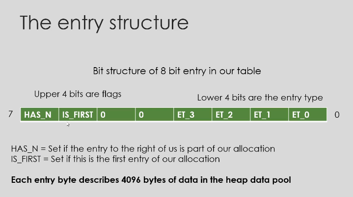

The entry structure
Bit structure of 8 bit entry in our table
Upper 4 bits are flags
Lower 4 bits are the entry type
7
HAS N
ISFIRST 
O
0
ET 3
ET 2
ET 1
ET O
HAS_N = Set if the entry to the right of us is part of our allocation
IS_FIRST = Set if this is the first entry of our allocation
Each entry byte describes 4096 bytes of data in the heap data pool

Entry types
• HEAP_BLOCK_TABLE_ENTRY_TAKEN - The entry is taken and the address cannot be used
• HEAP_BLOCK_TABLE_ENTRY_FREE - The entry is free and may be used

The data pool
• Simply a raw flat array of thousands or millions of bytes that our heap implementation can give to people who need memory.

Malloc example
• Firstly we assume we set our heap data pool to point to address 0x01000000
• We assume our heap is 100MB in size
• We assume we have 25600 entries in our entry table that describe our 100MB of data in the data pool. 100 MB/4096 = 25600

Malloc example - Memory allocation process
• Take the size from malloc and calculate how many blocks we need to allocate for this size. If the user asks for "5000" bytes we will need to allocate 8192 bytes because our implementation works on 4096 byte blocks. 8192 bytes is two blocks.
• Check the entry table for the first entry we can find that has a type of HEAP_BLOCK_TABLE_ENTRY_FREE, meaning that the 4096 block that this entry represents is free for use.
• Since we require two blocks we also need to ensure the next entry is also free for use otherwise we will need to discard the first block we found and look further in our table until we find at least two free blocks that are next to each other.
• Once we have two blocks we mark those blocks as taken.
• We now return the absolute address that the starting block represents. Calculation (heap_data_pool_start_address + (block_number* block_size))

Malloc step 1 - Finding the total blocks
• Block size = 4096
• Get the size provided to malloc. For example value "5000" we then align it to "4096" we get the value 8192.
• Now we just divide 8192 by our block size of "4096" which gives us 8192/4096 = 2. Two Blocks To Allocate
if ((5000% 4096) == 0)
{
return 5000;
}
uint32 t new_val = 5000 (5000% 4096);
new_val += 4096;
return new_val;

Malloc step 2 - Find two free blocks in the table
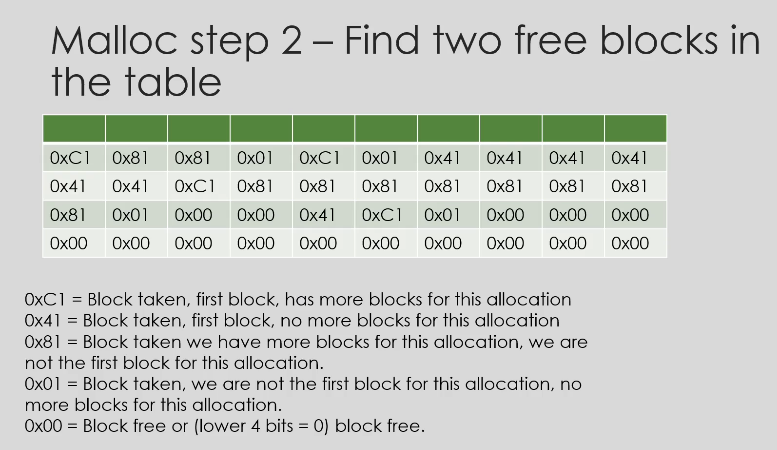
0xC1 = Block taken, first block, has more blocks for this allocation
0x41 Block taken, first block, no more blocks for this allocation
0x81 = Block taken we have more blocks for this allocation, we are not the first block for this allocation.
0x01 = Block taken, we are not the first block for this allocation, no more blocks for this allocation.
0x00 = Block free or (lower 4 bits = 0) block free.

Malloc step 3 - Calculate the absolute address the programmer can use
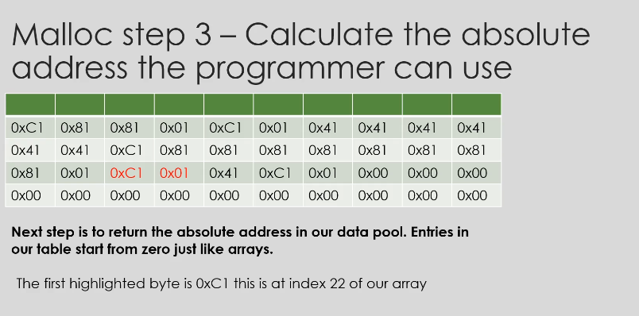
Next step is to return the absolute address in our data pool. Entries in our table start from zero just like arrays.
The first highlighted byte is 0xC1 this is at index 22 of our array 22* block_size (4096) = 90122 decimal. This is our offset
Our heap data pool starts at address 0x01000000 so we just add the offset 0x01000000 + 90122 decimal = 0x101600A Our absolute address our "malloc" implementation has found for us is 0x101600A or 16,867,338 decimal
We can now safely write our 5000 bytes to address 0x101600A.
Technically because its actually allocated 8,192 bytes due to our 4096 byte block size, we can use up to 8,192 bytes before overflowing into other peoples memory

Free example
• Calculate the block number based on the address provided to us to free
• Go through the entry table starting at the block number we have calculated, set each entry to "0x00" until we reach the last block of the allocation
• We know how many blocks we need to free because the current block we are freeing will not have the "HAS_N" bit set in the entry byte

Advantages of our implementation
• Fast to allocate blocks of memory
• Fast to free blocks of memory
• Can be written in under 200 lines of code (easy to implement)

Disadvantages of our implementation
• We allocate in memory blocks meaning misaligned sizes requested from our heap will result in wasted lost bytes.
• Memory fragmentation is possible

2^10*2^10*100 = 1024*1024*100 = 10,48,57,600
so, 100mb = 10,48,57,600 bytes

#of blocks = size/4096 = 10,48,57,600/4096 = 25600

to map the heap in the MEMORY, which doesn't overlap w/ the other things processor deals w/ https://wiki.osdev.org/Memory_Map_(x86)
https://wiki.osdev.org/Memory_Map_(x86)#:~:text=is%20not%20standardized.-,Extended%20Memory%20(%3E%201%20MiB),-The%20region%20of

the kernel is mapped at 0x00100000, so, the heap can be mapped at 0x01000000 https://wiki.osdev.org/Memory_Map_(x86)#:~:text=15%2D16MB%203-,0x01000000,-%3F%3F%3F%3F%3F%3F%3F%3F

need other 25600 bytes to store the entry table, so, the entry table can be mapped at 0x00007E00 to 0x0007FFFF	480.5 KiB, we need 25600/1024 KIBytes, 25KIB  https://wiki.osdev.org/Memory_Map_(x86)#:~:text=0x00007E00,480.5%20KiB

What Is Paging?
PAGING ALLOWS US TO REMAP MEMORY ADDRESSES TO POINT TO OTHER MEMORY ADDRESSES
CAN BE USED TO PROVIDE THE ILLUSION WE HAVE THE MAXIMUM AMOUNT OF RAM INSTALLED
CAN BE USED TO HIDE MEMORY FROM OTHER PROCESSES

Remapping Memory
• Paging allows us to remap one memory address to another, so 0x100000 could point to 0x200000.
• Paging works in 4096 byte block sizes by default. The blocks are called pages.
• When paging is enabled the MMU (Memory Management Unit) will look at your allocated page tables to resolve virtual addresses into physical addresses.
• Paging allows us to pretend memory exists when it does not.

Virtual addresses vs Physical addresses?
• Virtual addresses are addresses that are not pointing to the address in memory that their value says they are. Virtual address 0x100000 might point to physical address 0x200000 as an example.
• Physical addresses are absolute addresses in memory whose value points to the same address in memory. For example if physical address 0x100000 points to address 0x100000 then this is a physical address.
• Essentially virtual address and physical address are just terms we used to explain how a piece of memory is being accessed.

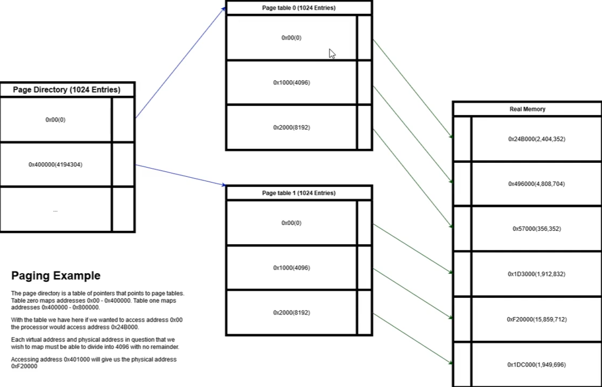

- page directory is a table of pointers to page tables
- page table is a table of pointers to physical memory
- page table entry is a pointer to physical memory

- in the picture above, 1024 entries in page directory, 1024 entries in page table, 1024 entries in page table entry, 4 KB page size
- so, each table can point to 1024*4 KB = 4 MB of physical memory
- so, 1024*1024*4 KB = 4 GB of physical memory can be accessed

- first index in page directory points to the first page table, that can point upto 4 MB of physical memory(0x00), next index in page directory points to the next page table, that can point upto 4 MB of physical memory(0x40000), and so on

  - first index in the first page table is a pointer to 4kb of physical memory, next index in the page table is a pointer to the next 4kb of physical memory, and so on
    - first index being address 0x00000000, next index being address 0x00001000(4096), and so on
  - first index in the seconde page table is a pointer to 4kb of physical memory, next index in the page table is a pointer to the next 4kb of physical memory, and so on
    - first index being address 0x00400000, next index being address 0x00401000(4096), and so on

Page Directory Structure
• Holds a pointer to a page table
• Holds attributes

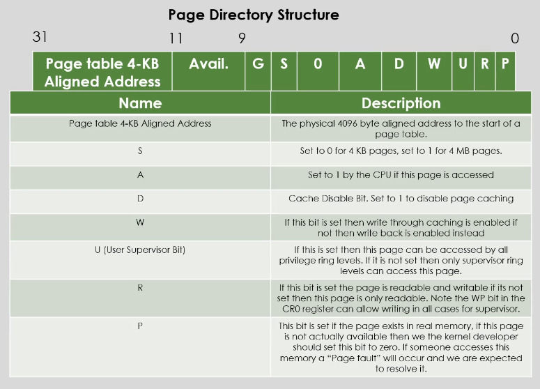

- page fault occurs if the page table entry doesn't point to any physical memory

Page Fault Exception
The CPU will call the page fault interrupt 0x14 when their was a problem with paging.
The exception is Invoked:
• if you access a page in memory that does not have its "P (Present)" bit set.
• Invoked if you access a page that is for supervisor but you are not supervisor.
• Invoked if you write to a page that is read only and you are not supervisor.

Hiding memory from processes
• If we give each process its own page directory table then we can map the memory for the process however we want it to be. We can make it so the process can only see its self.
• Hiding memory can be achieved by switching the page directories when moving between processes.
  - use assembly code to switch the page directory, and then jump to the process code
  - if interrupt, switch to kernel page directory, and then jump to the interrupt handler code
• All processes can access the same virtual memory addresses but they will point to different physical addresses.

Illusion of more memory
• We can pretend we have the maximum amount of memory even if we do not
• This is achieved by creating page tables that are not present. Once a process accesses this non-present address a page fault will occur. We can then load the page back into memory and the process had no idea.
• 100MB system can act as if it has access to the full 4GB on a 32 bit architecture.

Benefits to paging
• Each process can access the same virtual memory addresses, never writing over each other.
• Security is an added benefit as we can map out physical memory that we don't want processes to see.
• Can be used to prevent overwriting of sensitive data such as program code.

Enabling Paging

[BITS 32]
section.asm
global paging_load_directory
global enable_paging
paging_load_directory:
  push ebp
  mov ebp, esp
  mov eax, [ebp+8]
  mov cr3, eax ; pass the address of the page directory to cr3 register which was passed to the function as an argument
  pop ebp
  ret
enable_paging:
  push ebp
  mov ebp, esp
  mov eax, cro
  or eax, 0x80000000 ; set the paging bit in the cr0 register, changing the processor to paging mode
  mov cro, eax ; pass the modified cr0 register back to the cr0 register
  pop ebp
  ret

  https://wiki.osdev.org/Paging

can use paging to map address to some buffer in process memory, task switching, it can still write to video memory, but it's not writing to video memory, but is writing to buffer, when we switch back to process, we can copy all of the buffer to video memory, so, we can switch between processes without any flickering

We can't map hardware addresses w/ paging, cuz request to hardware is not through memory, but through I/O ports of the processor, so, we can't map hardware addresses to some buffer in process memory

What is a PCI IDE controller?
• IDE refers to the electrical specification of cables which connect ATA drives to another device
• IDE allows up to 4 drives to be connected
1. ATA (Serial): Used for modern hard drives
2. ATA (Parallel): Used for hard drives
3. ATAPI(Serial): Used for modern optical drives
4. ATAPI(Parallel): Commonly used for optical drives.
• Kernel programmers do not have to care if the drive is serial or parallel.

Possible Drive types
• Primary master drive
• Primary slave drive
• Secondary master drive
• Secondary slave drive

ATA Read Example 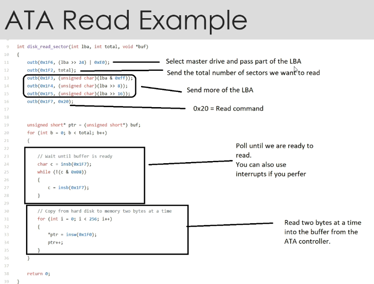

https://wiki.osdev.org/ATA_Command_Matrix

The buffer in your GDB output contains raw binary data that was read from disk sector 0 using disk_read_sector(0, 1, buffer);
Understanding the Buffer Contents
First Few Bytes: \353\"\220

These are raw bytes interpreted as characters. The ASCII characters \353, \", and \220 don't form readable text, meaning they likely represent machine code or some binary data.
The first sector (sector 0) typically contains a boot sector if you're working with a bootable system.
Series of '\000' (null bytes)

The buffer contains many '\000' (null bytes), meaning parts of the sector are either empty or zero-initialized.
Later Bytes Contain Machine Code

Bytes like \352)|\000\000\372\270\000\000\216 look like x86 machine instructions.
\352)|\000\000 (EIP jump instruction) suggests that this could be part of a bootloader or some low-level OS code.
Patterns Suggesting BIOS Parameter Block (BPB)

If this is a boot sector, it might contain a BIOS Parameter Block (BPB), which includes disk layout details.
The last two bytes of a valid boot sector should be 0x55 0xAA. You can check:
gdb
Copy
Edit
x/2xb buffer+510
If it prints 0x55 0xaa, it confirms that the sector contains a boot record.

What is a filesystem?
A FILESYSTEM IS A STRUCTURE THAT DESCRIBES HOW INFORMATION IS LAID ON A DISK
DISKS ARE NOT AWARE OF FILES
THE OPERATING SYSTEM KNOWS THE FILESYSTEM STRUCTURE SO KNOWS HOW TO READ FILES FROM THE DISK

Disks
• Hard disks can be thought of as just a giant array of information split into sectors.
• Each sector can be read into memory and is given a LBA (Logical Block Address) number
• Files do not exist on the disk.
• Disks have no concept of files

Filesystem structure
• Contains raw data for files (remember the disk isn't aware of this)
• Contains the filesystem structure header which can explain things such as how many files are on the disk, where the root directory is located and so on...
• The way files are laid out on disk is different depending on the filesystem you are using for example "FAT16", "FAT32", "NTFS", and more...
• Without filesystems we would be forced to read and write data through the use of sector numbers, structure would not exist and corruption would be likely.

FAT16(File Allocation Table) 16 bits
• The first sector in this filesystem format is the boot sector on a disk. Fields also exist in this first sector that describe the filesystem such as how many reserved sectors follow this sector.
• Then follows the reserved sectors these are sectors ignored by the filesystem. There is a field in the boot sector that specifies how many reserved sectors there are. (Remember the operating system must ignore these its not automatic! The disk has no idea)
• Now we have our first file allocation table, this table contains values that represent which clusters on the disk are taken and which are free. (A cluster is just a certain number of sectors joined together to represent one cluster)
• Next comes our second file allocation table it's optional though and depends on the FAT6 header in the boot sector.
• Now comes our root directory this explains what files/directories are in the root directory of the filesystem. Each entry has a relative name that represents the file or directory name, attributes such as read only, the address of the first cluster representing the data on the disk. And more...
• Finally we have our data region, all the data is here.

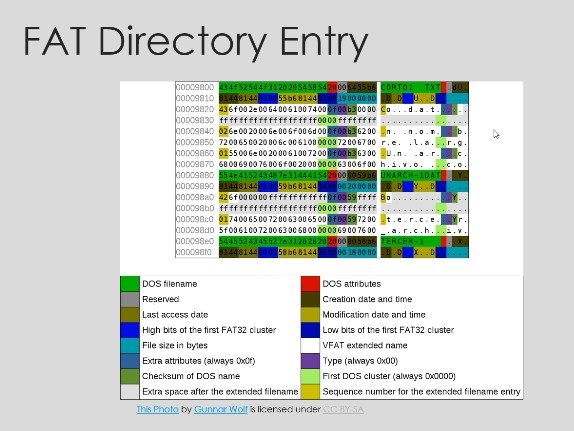

What to take away from this
• Disks don't understand files they are just giant flat arrays of bytes
• Operating systems need filesystem drivers so they can read from the disk
• Every filesystem is different
• Without implementing a filesystem in your operating system you cannot have files

testing streamer.c
- byte 0x201 is B8 of os.bin

FAT(FILE ALLOCATION TABLE)
What is the file allocation table?
- THE FILE ALLOCATION TABLE IS A FILESYSTEM DEVELOPED BY MICROSOFT
- IT CONSISTS OF A SERIES OF CLUSTERS THAT HOLD DATA AND A TABLE THAT DETERMINES THE STATE OF A CLUSTER
- THE BOOT SECTOR / BOOT LOADER STORES INFORMATION ABOUT THE FILESYSTEM

FAT16 Filesystem
• Uses clusters to represent data and subdirectories
• Each cluster uses a fixed amount of sectors which is specified in the boot sector
- Every file in FAT16 needs to use at least one cluster for its data this means a lot of storaage is wasted for small files.
• FAT16 cannot store files larger than 2GB without large file support. With large file support 4GB is the maximum.

DISK LAYOUT 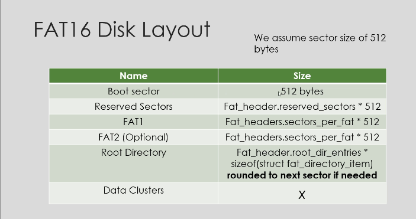
FAT16 Disk Layout
We assume sector size of 512 bytes
Name                  Size
Boot sector           512 bytes
Reserved Sectors      Fat_header.reserved_sectors * 512
FATI                  Fat_headers.sectors_per_fat * 512
FAT2 (Optional)       Fat_headers.sectors_per_fat * 512 //duplicate of FAT1
Root Directory        Fat_header.root_dir_entries * sizeof(struct fat_directory_item) rounded to next sector if needed
Data Clusters         X

FAT16 Boot Sector

jmp short _start
пор

; FAT16 header
OEMIdentifier db 'COS32 ; 512 bytes per sector
BytesPerSector dw 0x200
SectorsPerCluster
db 0x80
ReservedSectors
dw 200 ; the total size of reserved sectors is 200*512 = 102400 bytes, if the kernel exceeds size, the fat table will be corrupted by overwriting the fat table
FATCopies
db 0x02
RootDirEntries
dw 0x40
NumSectors
dw 0x0000
MediaType
db 0xF8
Sectors PerFAT
dw 0x0100
SectorsPerTrack
dw 0x20
NumberOfHeads
dw 0x40

Reserved sectors before FAT (TODO: is this BOOT?)
: Often this value is 2.
64 Root directory entries
If this value is 0, it means there are more than 65535 sectors in the vo
Fixed disk -> Harddisk
; Sectors used by each FAT Table
TODO: Look up? BIOS might change those
: Does this even matter?
Hidden Sectors
dd 0x00
SectorsBig
dd 0x773594
: Extended BPB (DOS 4.0)
DriveNumber
db 0x80
WinNTBit
db 0x00
: WinNT uses this
Signature VolumeID
db 0x29
0 for removable, 0x80 for hard-drive
; DOS 4.0 EBPB signature
dd 0x00000105
: Volume ID
VolumeIDString
SystemIDString
db "COS32 BOOT"; Volume ID
db "FAT16
: File system type, pad with blanks to 8 bytes

FAT16 File Allocation Table Explained

o Each entry in the table is 2 bytes long and represents a cluster in the data clusters region that is available
or taken.
· Clusters can chain together, for example a file larger than one cluster will use two clusters. The value that
represents the first cluster in the file allocation table will contain the value of the next cluster. The final
cluster will contain a value of 0xffff signifying that there are no more clusters.
o The size of a cluster is represented in the boot sector

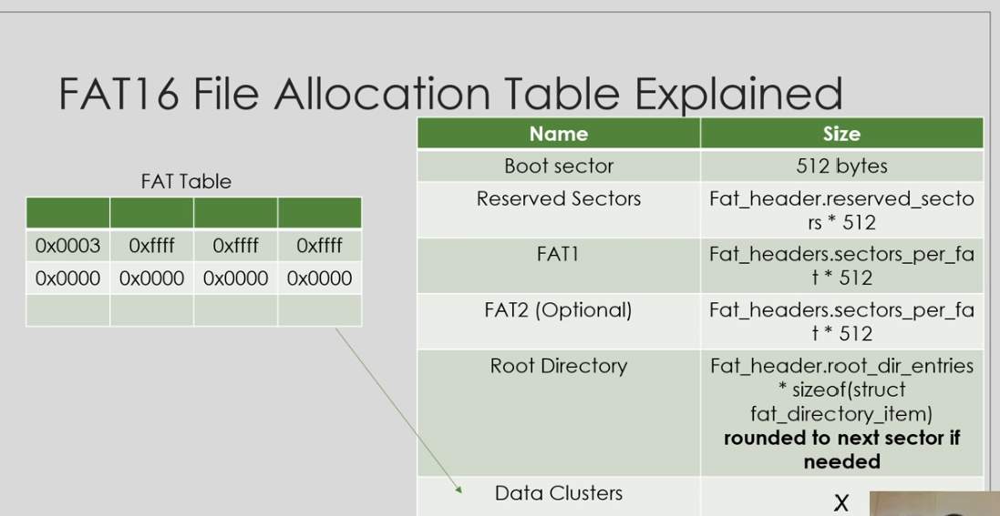

FAT16 Root Directory

· Filesystems have directories/folders. FAT16 is no different
. FAT16 has what's known as a root directory, this is the top most directory in the system
o Directories contain directory entries of a fixed size.

FAT16
Directory Entry
Attribute field contains flags
that determine if this
directory item is a file, or a
directory. If it's read only
and so on ...

If the directory item
represents a file, then the
first cluster points to the start
of the file data. If it's
representing a directory,
then its first cluster will point
to a cluster that has
directory entries.

struct fat_directory_item
{
uint8 t filename[$];
uint8_t ext[3];
uint8 t attribute;
uint8 t reserved;
uint8_t creation_time_tenths_of_a_sec;
uint16_t creation_time;
uint16 t creation_date;
uint16_t last_access;
uint16_t high_16_bits_first_cluster;
uint16_t last_mod_time;
uint16 t last mod date;
uint16_t low_16_bits_first_cluster;
uint32 t filesize;
}
__attribute__ ((packed));

Iterating through directories

. In the boot sector contains the maximum number of root directory entries we should not exceed this
value when iterating through the root directory.
o We know when we have finished iterating through the root directory or a subdirectory because the first
byte of the filename will be equal to zero

Directory entry attribute flags

0x01 - Read only
0x02 - File hidden

0x04 - System file do not move the clusters!

0x08 - Volume label

0x10- This is not a regular file it's a subdirectory (if this bit is not set then this directory entry represents a
regular file)

0x20 - Archived

0x40 - Device

0x80 - Reserved must not be changed by disk tools

FAT16 Filename and extensions

o The filename is 8 bytes wide and
unused bytes are padded with spaces
(0x20)
o The extension is 3 bytes wide and
unused bytes are padded with spaces
(0x20)

Clusters

· Each cluster represents a certain amount of sectors linearly to each other.
o The amount of sectors that represents a cluster is stored in the boot sector
o The data clusters section in the filesystem contains all the clusters that make up the subdirectories and file
data of files throughout the FAT filesystem.

Useful tips

Use "_attribute_((packed))" with all structures that are to be stored or read from disk. The C compiler
can do clever optimization's on structures and this is not what we want when working with raw data the
from disk. Setting the packed attribute ensures that never happens.
o Pay close attention to the upcoming videos, things are about to get more difficult mistakes could
happen
· Be prepared to use a debugger such as GDB and attach debugging symbols as shown in previous
lectures, you might need to debug if you run into issues.

Step | What Happened
sudo mount -t vfat bin/os.bin /mnt/d | Tell Linux: "Treat bin/os.bin like a disk and show it under /mnt/d"
cd /mnt/d | You browsed inside the mounted filesystem
touch hello.txt | You tried to create a file in that filesystem

Understanding the VFS Layer

THE VIRTUAL FILESYSTEM LAYER
ALLOWS A KERNEL TO SUPPORT AN
INFINITE AMOUNT OF FILESYSTEMS

THE VIRTUAL FILESYSTEM LAYER
ALLOWS US TO ABSTRACT OUT LOW-
LEVEL FILESYSTEM CODE.

ALLOWS FILESYSTEM FUNCTIONALITY
TO BE LOADED OR UNLOADED TO
THE KERNEL AT ANY TIME.

Unlimited Filesystems

o Filesystem drivers can be loaded or unloaded on demand
· The programming interface to the filesystems remains the same for all filesystems

What happens when a disk gets
inserted?

· We poll each filesystem and ask if the disk holds a filesystem it can manage
o We call this resolving the filesystem
. When a filesystem that can be used with the disk is found then the disk binds its self to its implementation.

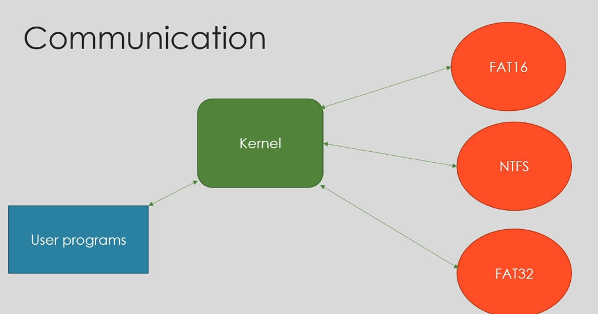

fopen, kernel talks to correct fs, cuz kernel knows the correct fs, drive number is binded to disk, disk is binded to fs

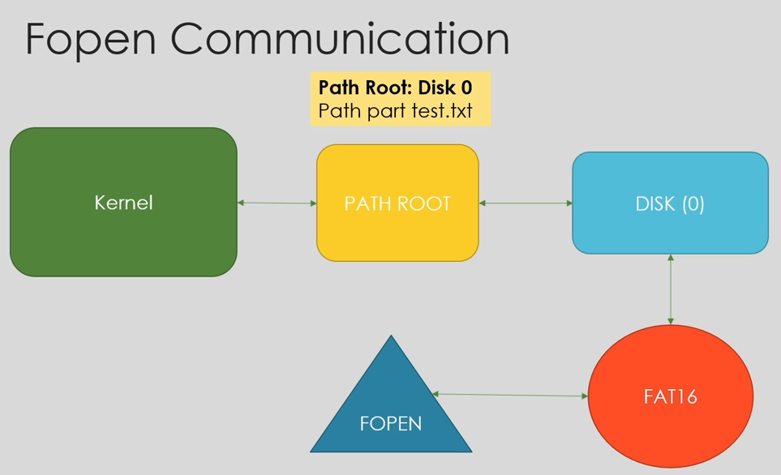

the fopen function of fs is called, using fn pointers, this returns the file descriptor to the kernel, which is then returned to the user

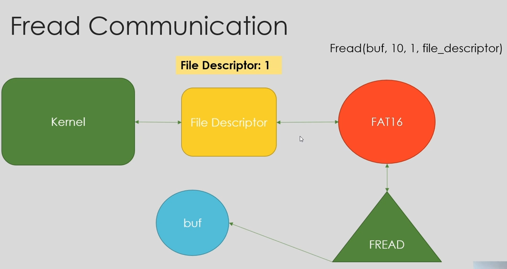

fread of the fs is called w/ the buffer, # of bytes to be read, file decriptor, 

Overview

o The Virtual filesystem layer allows infinite amount of filesystems
· All the filesystem functionality uses the same interface
o The caller of file routines does not have to care about which filesystem to use